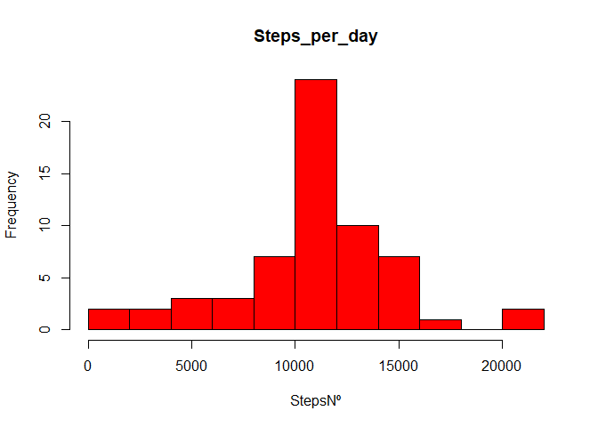

## Loading and preprocessing the data. Also loading dplyr to work easier.


```r
library(dplyr)
```

```
## 
## Attaching package: 'dplyr'
```

```
## The following objects are masked from 'package:stats':
## 
##     filter, lag
```

```
## The following objects are masked from 'package:base':
## 
##     intersect, setdiff, setequal, union
```

```r
Data <- read.csv(unz("activity.zip", "activity.csv"), header = T)
```


## What is mean total number of steps taken per day?

```r
SPD <- Data %>% 
  group_by(date) %>% 
  summarise(Steps_per_day = sum(steps))

hist(SPD$Steps_per_day, main="Steps_per_day", xlab="StepsNº", col="red", breaks=10)
```

<!-- -->

```r
meanSteps_per_day <- mean(SPD$Steps_per_day, na.rm = T)
medianSteps_per_day <- median(SPD$Steps_per_day, na.rm = T)
```

The mean is 1.0766189\times 10^{4} and the median is 10765.


## What is the average daily activity pattern?


```r
SPI <- Data %>% 
  group_by(interval) %>% 
  summarise(Steps_per_Interval = sum(steps, na.rm = T))

plot(SPI$interval,SPI$Steps_per_Interval, type="l", xlab = "5 min interval", ylab = "Steps_per_Interval")
```

<!-- -->

```r
MaxStepsInt<-SPI$interval[which.max(SPI$Steps_per_Interval)]
```
The interval with more steps averaged across all days is 835.


## Imputing missing values

```r
NAnumber<-sum(is.na(Data))
```
The number of missing data is 2304.

The strategy selected for imputing missing values is making the average for the 5-minute interval across all days.We calculate it, create a new column with the average per interval and join it with the original data table, keepeng the averaged value when we don't have any. 


```r
ASPI <- Data %>% 
  group_by(interval) %>% 
  summarise(Aver_Steps_per_Interval = mean(steps, na.rm = T))

Data2 <- full_join(Data, ASPI, by="interval") %>%
  mutate(steps=case_when(is.na(steps)~as.integer(Aver_Steps_per_Interval), TRUE ~ steps)) %>%
  select(steps,date,interval)
```
Finally we calculate the number of steps taken, make the histogram and calculate mean and median.

```r
SPD2 <- Data2 %>% 
  group_by(date) %>% 
  summarise(Steps_per_day = sum(steps))

hist(SPD2$Steps_per_day, main="Steps_per_day", xlab="StepsNº", col="red", breaks=10)
```

<!-- -->

```r
meanImp_Steps_per_day <- mean(SPD2$Steps_per_day, na.rm = T)
medianImp_Steps_per_day <- median(SPD2$Steps_per_day, na.rm = T)
```

The new mean is 1.074977\times 10^{4}.
The new median is 10641.

Comparing it to the unmodified data, we see that the most frequent break (10,000-12,000) has increased in frequency. That is due to using the average of steps per interval to replace NA.


## Are there differences in activity patterns between weekdays and weekends?

We load the library timeDate to make te separation between weekends and weekdays easier.


```r
library(timeDate)
WeeklyData <- Data2 %>%
  mutate(
    dayType=case_when(
      isWeekend(as.Date(Data2$date))~"weekend",TRUE~"weekday"))

WeeklyData$dayType<-as.factor(WeeklyData$dayType)

Weekdays<-WeeklyData %>%
  filter(dayType=="weekday") %>%
  group_by(interval) %>% 
  summarise(Steps_per_Interval = mean(steps, na.rm = T))

Weekends<-WeeklyData %>%
  filter(dayType=="weekend") %>%
  group_by(interval) %>% 
  summarise(Steps_per_Interval = mean(steps, na.rm = T))

plot(Weekdays$interval,
     Weekdays$Steps_per_Interval, 
     type="l", 
     xlab = "5 min interval", 
     ylab = "Steps_per_Interval",
     main = "Weekdays")
```

<!-- -->

```r
plot(Weekends$interval,
     Weekends$Steps_per_Interval, 
     type="l", 
     xlab = "5 min interval", 
     ylab = "Steps_per_Interval",
     main="Weekends")
```

<!-- -->

As we can see from plots there are different activity patterns at the weekends and at the weekdays. At the weekends we see an almost uniform distribution. At the weekdays there is a clear peak in the morning.
